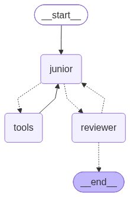

# junior + reviewer (с исполнением кода через MCP)

Небольшой пет-проект на langgraph. Идея простая: одна модель (junior) пишет код,
вторая (reviewer) его ревьюит. Но не на глаз — код реально запускается, и вердикт
reviewer'а опирается на результат прогона. Всё крутится на локальной модели через ollama.

Прогон кода вынесен в отдельный MCP-сервер (fastmcp), приложение цепляет его как MCP-клиент.

## как это работает



- **junior** пишет код и сам гоняет его через `run_python`, чтобы убедиться что работает
- **reviewer** берёт финальный код, ещё раз прогоняет и по факту прогона пишет APPROVED или REVISE.
  если код упал — это всегда REVISE (см. промпт).
- крутимся до MAX_ITER кругов.

схема графа при старте падает в graph.png

## файлы

- `main.py` — цикл в консоли (async)
- `graph.py` — узлы junior/tools/reviewer + MCP-клиент (MultiServerMCPClient)
- `code_server.py` — сам MCP-сервер, тут живёт run_python
- `prompts.py` — промпты
- `config.py` / `state.py` / `utils.py` — по мелочи (конфиг, стейт, хелперы)

MCP-сервер отдельно поднимать НЕ надо, клиент сам его дёргает по stdio

## настройки

всё через .env (читается в config.py). дефолты:

```
OLLAMA_MODEL=llama3.2:latest
OLLAMA_URL=http://localhost:11434
MAX_ITER=3            # сколько кругов ревью
MAX_RETRIES=3         # ретраи если вызов графа упал
RETRY_DELAY=1
MAX_MESSAGES=16       # окно истории
EXEC_TIMEOUT=10       # лимит на выполнение кода, сек
```

модель обязательно должна уметь tool calling, иначе junior не сможет звать run_python.
llama3.2 умеет.

## запуск

локально (нужен установленный ollama):

```bash
pip install -r requirements.txt
ollama pull llama3.2:latest
python main.py
```

в докере — есть docker-compose, поднимает ollama + приложение:

```bash
docker compose up --build
docker exec -it ollama ollama pull llama3.2:latest   # модель надо один раз подтянуть
```

дальше пишешь запросы в консоль, `exit` для выхода.

## осторожно

run_python выполняет код БЕЗ песочницы, тем же питоном, с доступом к диску и сети.

TODO: прикрутить ruff/pytest в отдельные MCP-тулзы, чтобы ревью было ещё жёстче
